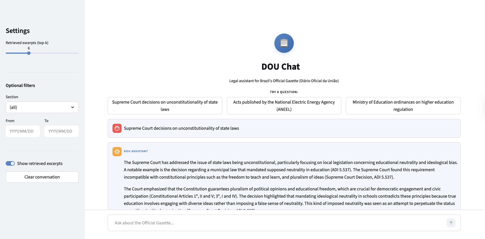

# DOU Chat

**Live app: https://dou-chat-llm.streamlit.app/**



**Semantic search and Q&A over Brazil's Diário Oficial da União using RAG.**

Legal professionals spend hours manually scanning the DOU for relevant acts. DOU Chat lets them ask questions in natural language and get cited, source-grounded answers in seconds.

---

## How it works

```
User question
     │
     ▼
Embedding (multilingual-e5-large)
     │
     ▼
Vector similarity search (DuckDB VSS / MotherDuck)
     │
     ▼
Top-k chunks retrieved with metadata (órgão, seção, data)
     │
     ▼
LLM generation with grounded context (Llama 3.3 via Groq / Ollama)
     │
     ▼
Answer with source citations
```

---

## Embedding Model Evaluation

Three models benchmarked over 12 legal queries. `multilingual-e5-large` (1024d) used in production: higher latency offset by significantly better retrieval quality.

| Model | Cosine Distance ↓ | Euclidean Distance ↓ | Avg Latency |
|---|---|---|---|
| **multilingual-e5-large** | **0.164** | **0.571** | 1.475s |
| BAAI/bge-m3 | 0.458 | 0.955 | 1.052s |
| LaBSE | 0.601 | 1.094 | 1.068s |

---

## LLM Evaluation

Three models benchmarked over 5 legal queries with `multilingual-e5-large` (fixed). Judge: Qwen3 32B with thinking via Groq. Metrics: Answer Relevance, Context Relevance, Groundedness (RAG Triad via TruLens).

| Model | Answer Rel. ↑ | Context Rel. ↑ | Groundedness ↑ | Avg |
|---|---|---|---|---|
| **Magistral Medium** | **0.44** | **0.56** | **0.90** | **0.63** |
| Llama 3.3 70B | 0.50 | 0.48 | 0.56 | 0.51 |
| Gemini 2.5 Flash | 0.14 | 0.61 | 0.64 | 0.46 |

Magistral Medium wins — notably higher groundedness (0.90 vs 0.56), meaning answers stay closer to retrieved context with less hallucination. Set as production model.

```bash
python tests/run_trulens_eval.py --mode api
```

---

## Features

- Natural language Q&A over DOU publications (Seções 1, 2, 3 and extras)
- Filters by section, issuing body, and date range
- Source citations on every answer (órgão, seção, date)
- API fallback chain on rate limits: Magistral Medium → Llama 3.3 → Gemini → Qwen3
- Local inference support via Ollama (phi4:14b)
- Bilingual UI (English / Portuguese) _(todo)_
- Evaluation pipeline with TruLens (embedding benchmarks, answer relevance, context relevance, groundedness)

---

## Stack

| Layer | Technology |
|---|---|
| Frontend | Streamlit |
| Embeddings | `intfloat/multilingual-e5-large` (1024d) |
| Vector store | DuckDB VSS / MotherDuck |
| LLM (API) | Magistral Medium (primary), Llama 3.3 70B, Gemini 2.5 Flash, Qwen3 32B |
| LLM (local) | phi4:14b via Ollama |
| LLM router | LiteLLM |
| Evaluation | TruLens |
| Observability | Arize Phoenix _(todo)_ |
| Ingestion | Python + schedule (Airflow planned) |

---

## Project structure

```
├── app.py                  # Streamlit chatbot
├── ingestion/              # DOU download and parsing
├── indexing/               # Chunking, embedding, and MotherDuck storage
├── rag/                    # Query engine (retrieval + generation)
├── evaluation/             # TruLens test queries
├── run_trulens_eval.py     # Evaluation runner
└── observability/          # Phoenix tracing setup
```

## Setup

```bash
# 1. Clone and install
python -m venv .venv && source .venv/bin/activate
pip install -e .

# 2. Set environment variables
cp .env.example .env
# Add MOTHERDUCK_TOKEN, GEMINI_API_KEY, GROQ_API_KEY, MISTRAL_API_KEY

# 3. Run the chatbot
streamlit run app.py
```

For local inference, start Ollama with `phi4:14b` before running the app.
